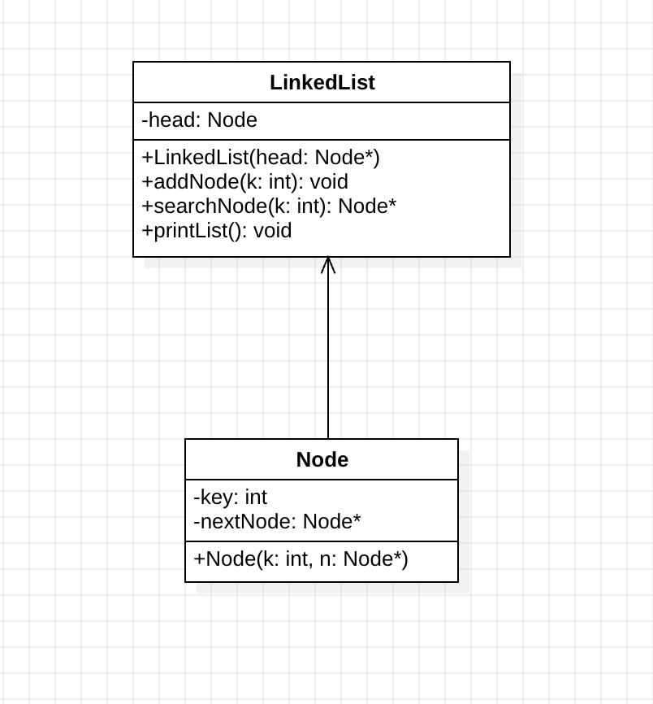

# Incontro - 1

Negli esempi riportati si evidenziano le differenze tra una lista singolarmente concatenata scritta in C, che riflette il paradigma 'procedurale' del linguaggio e
una lista singolarmente concatenata scritta in C++ che invece mette in risalto le funzionalita' del linguaggio a oggetti

----

## UML Diagram per la struttura dati

